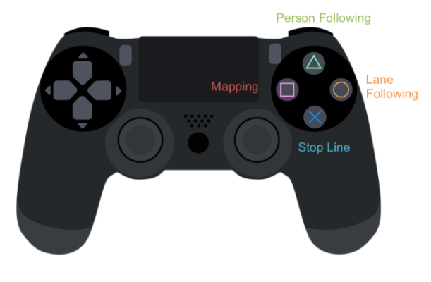

# Final Project - Robotics Quadrathlon

## Team - TechnoKnights

### Team Members:
```
Lead: Deepak Reddy
Kalpesh Kuber
Om Kukunuru
```

Four main tasks needed to be executed on Jackal namely,
```
1. Stop line Challenge 
2. Lane Following
3. Room patrolling
4. Person following
```

These 4 tasks are controlled using ps3 joystick controller with individual button presses  


As you can see from the above image, the controller working is designed as per the requirements. A brief overview on it's working:
```
Once the joystick is launched and up and running:
-Click any button from 'square','triangle', 'circle', 'X' to start any task
-To switch to any task from on task click R1 or L1 and then use other button
-This L1 and R1 are also used to switch into manual modes
```

### Steps to follow to execute the project:
-Power on the jackal and ensure all the lights (Motor, Wifi) are ON
-Connect to jackal using the below command (connecting to jackal3 here)
```
ssh rsestudent@jackal3
```
-Copy the sensor.urdf file from 'urdf' directory and paste as 'sensors.urdf' in 'home/rsestudent' on jackal 
-Clone this at any location on the jackal andnavigate to *technoknights/robster*. 'robster' is the workspace you will be working on from now
```
..../cd technoknights/robster
```
-Build the project
```
..../technoknights/robster/$catkin_make
```
-source the project
```
source devel/setup.bash  
```
-Open a new tab in terminal and source the setup file in the new terminal. This terminal is also used for execution

### Now,we are ready for the execution:
-launch the main launch file which is present in *quad* package on the first terminal 
```
roslaunch quad main.launch
```
-Navigate to the scripts folder in the *quad* package of robster workspace on the second terminal and execute the following command to bring up the joystick controller
```
python joystick.py
```
You can also execute
```
rosrun quad joystick.py
```
This will start the ps3 controller.
-Use the controller as described above to start/stop any task
 
To view the jackal environment on rviz, follow the above process for cloning, building files and sourcing on the local desktop terminal and follow the below steps:
-Source 'remote-jackal.sh' in this terminal by navigating into the location of the file (edit the file based on the jackal you are connecting to)
```
../technoknights/remotejackalconnect/source remote-jackal.sh
```
-ensure that the destop is connected to the jackal remotely, by viewing the topics
```
rostopic list 
```
-open the rviz and open the topics you want to view for the jackal environment
```
rosrun rviz rviz 
```
-For *room patrolling*, you can run the following command to save the map in any location(either on jackal or local desktop)
```
rosrun map_server map_server mymap.yaml
```

You can find the presentation of this project in the repository for more details.   Thank you.  


